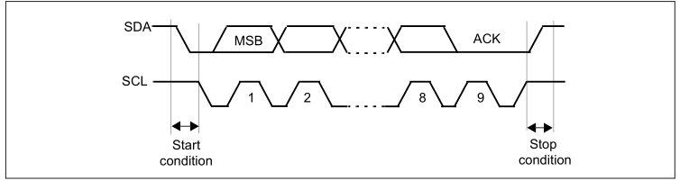

#### General

I2C使用两根线就可以进行通信，一条SDA数据线，一条SCL时钟线。
空闲状态下，SDA和SCL线都处于高电平状态。

在I2C总线上的设备默认都是从机模式，谁先发起start谁就是主机，当数据交互结束后主机自动退回到从机模式，所有的设备等待下一轮的交互。

I2C除了一对一的主从模式外也可以有一对多的主从模式，即广播模式。在广播模式下，7bit地址都为0,而且只能进行写操作。
___

#### Protocol

在主机模式，I2C会发起数据传输并产生时钟信号。
一个完整的数据传输序列总是由起始状态开始，由停止状态结束。二者都是由主机的软件控制的。

在从机模式下，I2C能够识别自己的地址和广播地址(General Call Address)，其中广播地址可以通过软件设置为开启或关闭。

地址和数据都是以8bit为单位进行传输的。其中跟在其实状态后的第一个字节或第二个字节包含地址信息(地址为7bit时需要一个字节，地址为10bit时需要两个字节)。地址信息总是由主机发出的。

经过8个数据传输的时钟周期后，在第9个时钟周期从机需要发送应答位。
___

#### Master Mode

设备通过拉低SDA进入主机模式，然后需要发送7位或10位地址。7位地址只需要一个byte就可以发送成功；10位地址则需要分两个bytes发送，其中第一个byte被称为header，其bit序列为1110xx0(这里的xx代表10位地址的两个MSB)，然后第二个byte包含从机的8位地址。

主机可以决定进入transmitter或者receiver模式，这个取决于地址byte中LSB的设置。
对于7位地址：地址字节LSB为0,主机进入transmitter模式；设置为1进入receiver模式。
对于10位地址：正常发送地址信息，主机进入transmitter模式；正常发送地址信息后，又发送一个 repeate start condition(header为11110xx1)，主机进入receiver模式。

##### Master Transmitter
Master发送完最后一个字节，然后设置STOP bit就可以中断对话并退回到slave模式。

##### Master Receiver
Master接收完最后一个字节，发送NACK，这时slave会释放对SCL和SDA线的控制，然后master发送STOP bit。
___

#### Slave Mode
配合master上述操作。
