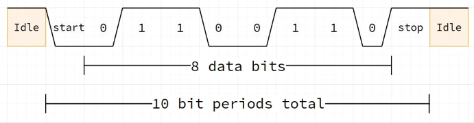

#### General

UART（通用异步收发传输）通信通常需要两到四根线，具体取决于通信方式和是否需要额外的控制信号。

必要的通信线： TX， RX (实际上GND也是必须的，但不算在通信线里面)
可选的控制线： 硬件控流模式(Hardware Control Flow)下需要的控制线
&nbsp;&nbsp;&nbsp;&nbsp;RTS(Request to Send)：由本端输出，当拉低时表示“我已经准备好接收数据”
&nbsp;&nbsp;&nbsp;&nbsp;CTS(Clear to Send)：由对端输出，当拉高时表示“你可以向我发送数据”

UART没有Clk线，这就要求通信双方需要以协商好的速率进行通信。
___

#### Protocol

##### Data Frame

在普通的UART模式下，数据的收发是通过数据帧(Frame)实现的，数据帧的组成大致如下：

1. 空闲线(Idle Line)
    在真正进行数据收发之前，线路保持高电平的状态，显示总线空闲，方便同步。
2. 起始位(Start Bit)
    起始位是持续一个周期的低电平信号，用来标识新一帧的开始。接收器检测到该信号后，就会按照预设的波特率采样后续的数据位。
3. 数据字(Data Word)
    可选8位或9位数据，最低有效位先发送。
    如果启用了奇偶校验Parity，第九位可以作为校验位，在数据位之后插入。
4. 停止位(Stop Bit)
    用高电平来标识一帧的结束，并让总线恢复到空闲状态。停止位的长度可配置为0.5,1,1.5,2个周期

Baudrate = bit periods / second.
E.g. baudrate of 115200: 115200 bits/second => 11.5KiB/s

##### Special Frame

*Idle Character*： 整个数据帧都是逻辑1。
*Break Character*： 整个数据帧都是逻辑0,后接1到2个停止位。
Idle和Break并不是用来传递数据，而是用来同步，唤醒或标记消息边界，比如下面几个典型的应用：

1. 在 LIN 协议中，主机发出的 Break Field（断续字段）就是一个持续至少 13 个位时间的低电平，相当于一个“超长的 0”──用来告诉所有从节点：“马上要发报文头了，请同步时钟、清空接收缓冲”。接着是一个“Sync 字节”（0x55），再是 ID 字节。
2. 自动波特率检测。TM32 USART 支持在接收到一个 Break（长低平­），或特殊的同步字节（如 0x55，0101 0101），自动测量位周期，从而自动计算出波特率分频。这在接入波特率未知的外设时非常方便——只要外设先发一个 Break 或同步字节，MCU 即可自校准。
3. 当 MCU 进入 STOP 或 STANDBY 等低功耗模式后，可以配置 USART 的 Wake-up by IDLE 或 Wake-up by BREAK 功能

___

#### Driver Interface

如果需要自己实现一个UART driver，那么下面的public API可以参考：

- `void     uart_setup(void)`
- `void     uart_write(uint8_t* data, const uint32_t length)`
- `void     uart_write_byte(uint8_t data)`
- `uint32_t uart_read(uint8_t* data, const uint32_t length)`
- `uint8_t  uart_read_byte(void)`
- `bool     uart_data_available(void)`